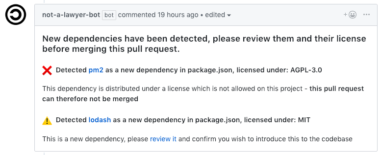

# Not A Lawyer Bot

> A GitHub App built with [Probot](https://github.com/probot/probot) to scan for dependency licenses during code reviews.
> Notice, this bot is still in a beta state running on a small heroku instance. 

## What will it do?
When a new pull request is submitted it will scan the changed files to determine if there are any changes to support package managers (npm, pip, gradle and sbt currently supported). It will then attempt to lookup the license of all new dependencies. 

The bot will warn the reviewer to be aware of new dependencies with a comment on the PR, if the dependency license is block due to exclude/allow settings it will also block the PR from being merged - for this to work



## How to use
Install the bot from its public github page: https://github.com/apps/not-a-lawyer-bot - by default the bot will warn about all new dependencies and blocks new dependencies which are not part of the [default list of allowed licences](#Licenses-allowed-by-default)

You can configure the bot by adding a `/.github/notalawyer.yml` file with the following options, both settings are optional to enable a either allow or exclude permission model of specific licences based on their [SPDX identifier](https://spdx.org/licenses/):

``` yaml
onlyallow: 
  - MIT
  - ISC

exlude:
  - AGPL-3.0
```

It is also possible to allow certain groups of licenses using following: `publicdomain`, `permissive`,`weakcopyleft`, `strongcopyleft` or `networkcopyleft` - the [licensetypes configuration file](https://github.com/perploug/NotALawyerBot/blob/master/src/config/licensetypes.ts) contains the specific licenses these groups represent:

``` yaml
onlyallow: 
  - permissive
  - weakcopyleft
```

## Licenses allowed by default
By default the bot uses a standard list of permissive and weak copyleft licenses - so if it cannot find a configuration file, this are the licenses allowed by default.

```
      'AFL-2.1',      'AFL-3.0',      'APSL-2.0',     'Apache-1.1',   'Apache-2.0',
      'Artistic-1.0', 'Artistic-2.0', 'BSD-2-Clause', 'BSD-3-Clause', 'BSL-1.0',
      'CC-BY-1.0',    'CC-BY-2.0',    'CC-BY-2.5',    'CC-BY-3.0',    'CC-BY-4.0',
      'CC0-1.0',      'CDDL-1.0',     'CDDL-1.1',     'CPL-1.0',      'EPL-1.0',
      'FTL',          'IPL-1.0',      'ISC',          'LGPL-2.0',     'LGPL-2.1',
      'LGPL-3.0',     'LPL-1.02',     'MIT',          'MPL-1.0',      'MPL-1.1',
      'MPL-2.0',      'MS-PL',        'NCSA',         'OpenSSL',      'PHP-3.0',
      'Ruby',         'Unlicense',    'W3C',          'Xnet',         'ZPL-2.0',
      'Zend-2.0',     'Zlib',         'libtiff'
```


## Setup

```sh
# Install dependencies
npm install

# Run typescript
npm run build

# Run the bot
npm start
```

## Contributing

If you have suggestions for how notalawyerbot could be improved, or want to report a bug, open an issue! We'd love all and any contributions. The logic for detecting and looking up licenses are powered by https://github.com/perploug/license-lookup - if you wish to add support of another format or fix/submit issues - please do son on the license-lookup project tracker. 

For more, check out the [Contributing Guide](CONTRIBUTING.md).

## License

[MIT](LICENSE) © 2019 Per Ploug <per.ploug@zalando.de> (https://plo.ug)
